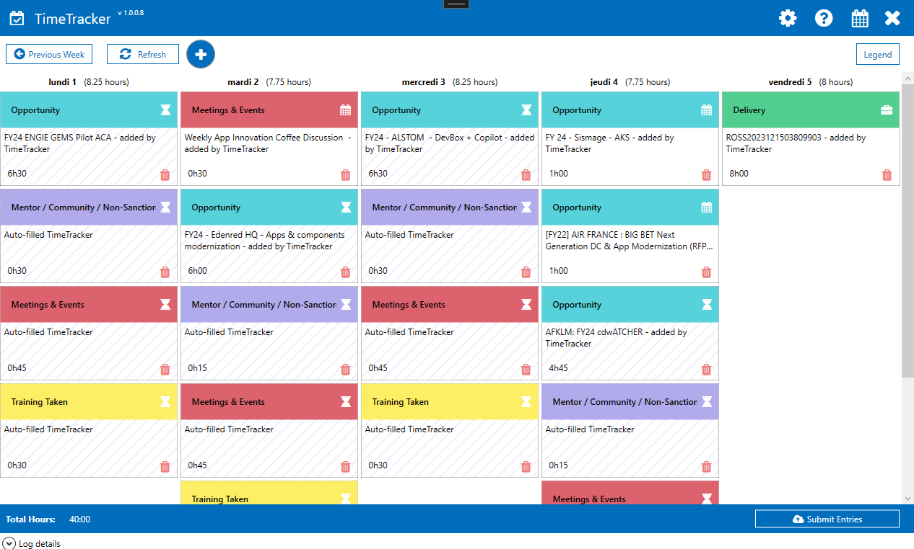

## Usage

{}

### Watch the quick explanatory video

### Download the last version

Go on the [releases](https://github.com/lgmorand/TimeTrackerProject/releases) page and select the last version.

### Configure it

Just run the application by clicking the TimeTracker.exe icon. On first startup, you should have the configuration wizard which asks for you Microsoft alias (i.e.: "lomorand").

> If you give the wrong alias, the application won't work, so don't be clumsy ;-)

{}
